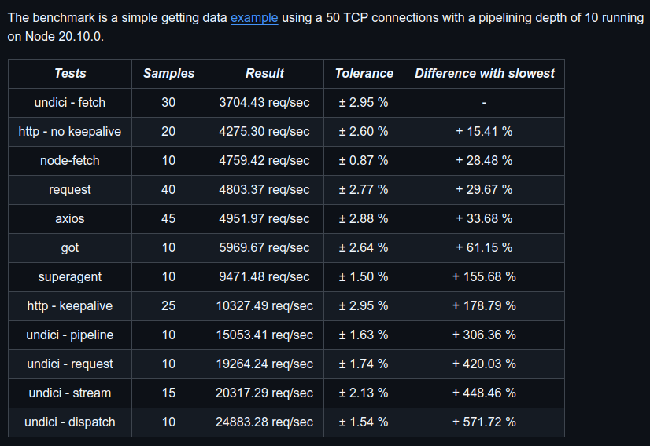
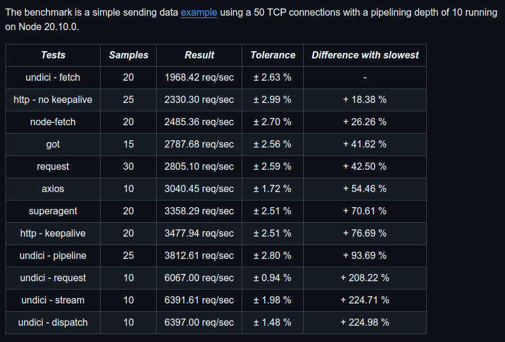

<!-- markdownlint-configure-file { "MD033": false } -->

# Nest HTTP

[](https://github.com/0xTheProDev/distributed-lock)

---

[](https://github.com/sponsors/0xTheProDev)
[](https://nodejs.org)
[](https://www.npmjs.com/package/@theprodev/nest-http)
[](https://www.npmjs.com/package/@theprodev/nest-http)
[](https://www.npmjs.com/package/@theprodev/nest-http)
[](https://www.npmjs.com/package/@theprodev/nest-http)
[](https://codecov.io/github/0xTheProDev/js-utils)
[](https://www.npmjs.com/package/@theprodev/nest-http)
[](https://github.com/0xTheProDev/js-utils/blob/main/LICENSE)
[](https://github.com/0xTheProDev/js-utils/issues)
[](https://github.com/0xTheProDev/js-utils/issues?q=is%3Aissue+is%3Aclosed)
[](https://github.com/0xTheProDev/js-utils/pulls)
[](https://github.com/0xTheProDev/js-utils/pulls?q=is%3Apr+is%3Aclosed)
[](https://github.com/0xTheProDev/js-utils/graphs/contributors)
[](https://github.com/0xTheProDev/js-utils/pulse)

## Description

> A Distributed Locking Mechanism implemented using Redis to provide Mutual Exclusion over Shared Resources in a Microservices Architecture.

In modern digital systems, we are often working with Distributed Workloads, Horizontal Scaling and Microservices. These systems do not share the same memory spaces or sometimes even the same host machine. Because of which traditional Mutex and Semaphore does not adapt with the current requirements to acquire exclusive access to shared resources. This library aims to bridge that gap using a common Remote Dictionary Server (Redis) with special attention to easy to integrate APIs and performance.

[Read More](https://martin.kleppmann.com/2016/02/08/how-to-do-distributed-locking.html).

## Installation

Install this package using your preferred package manager. See the example of [yarn](https://yarnpkg.com):

```sh
yarn add @theprodev/nest-http
```

## Usage

Most common usage entails defining and configuring the `HttpModule` using a predefined global module `ConfigModule` and use appropriate configuration options to pass on to this module.

```ts
import { HttpModule } from "@theprodev/nest-http";

@Module({
  imports: [
    HTTPModule.forRootAsync({
      imports: [ConfigModule],
      inject: [ConfigService],
      useFactory: (cfg: ConfigService) => cfg.httpOptions,
    }),
  ],
})
export class AppModule {}
```

For any further usage, refer to the [Type Declaration](https://www.typescriptlang.org/docs/handbook/declaration-files/introduction.html) shipped with the package. Make sure your editor or IDE is capable of powering intellisense from the declaration file provided.

## Testing

- To run all the unit test suites, run the following after all the dependencies have been installed:

```sh
yarn test
```

- To collect coverage on the tested files, execute the following command:

```sh
yarn test:cov
```

## Benchmarks

See the benchmarks of `Undici` released by official Node.JS Maintainers committee.

<table>
  <tbody>
    <tr>
      <td>
        <a href="https://github.com/nodejs/undici?tab=readme-ov-file#benchmarks">
          
        </a>
      </td>
      <td>
        <a href="https://github.com/nodejs/undici?tab=readme-ov-file#benchmarks">
          
        </a>
      </td>
    </tr>
  </tbody>
</table>

## Reporting a Bug

Head on to [**Discussion**](https://github.com/0xTheProDev/js-utils/discussions) section to report a bug or to ask for any feature. Feel to add your queries about using this library as well under _Q & A_ section of it. Remember, do not create any Issues by yourself, maintainers of this repository will open one if deemed necessary.

## Changelog

See [CHANGELOG](CHANGELOG.md) for more details on what has been changed in the latest release.

## Contributing

See [Contributing Guidelines](../../.github/CONTRIBUTING.md).

## License

This project is licensed under the terms of the MIT license, see [LICENSE](LICENSE) for more details.

<a href="https://github.com/0xTheProDev">
  
</a>
